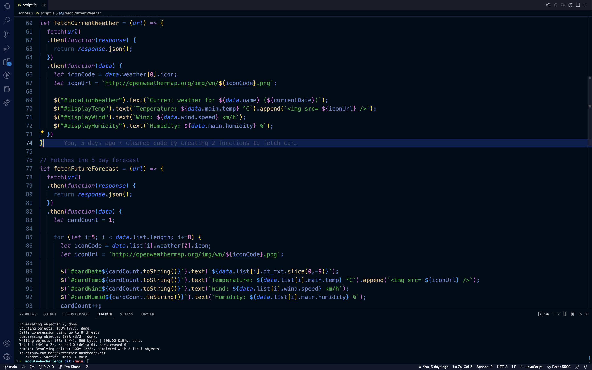
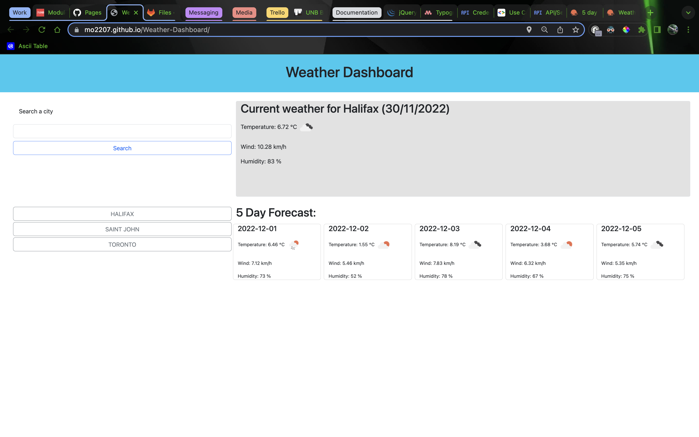

# Weather-Dashboard

## Description:
  
This application is a weather dashboard that displays current and future 5 day forecast for the users current location and any searched cities.
  - My motivation for this project was to create an application where I can view the weather. 
  - I built this application to get better at accessing and using data from api's.
  - Building this project I learned how to more thoroughly read through documentation and use it to problem solve.
  
## Installation:
This project can be viewed using the live server or view in default browser extensions in VScode.

Or it can be viewed on github pages here: https://mo2207.github.io/Weather-Dashboard/

## Usage:

## Credits:
I built this myself.

## License:
MIT license
